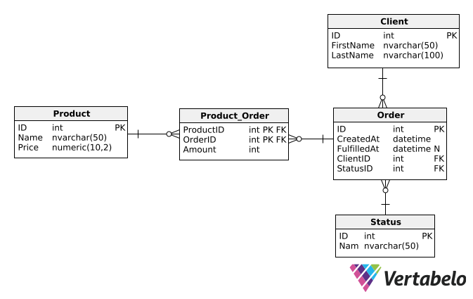

### 1. New Solution
- git
- SDK 9.0
- Web API

### 2. `appsettings.json`

> Zmień nazwę bazy danych w connection stringu.

```json
  "AllowedHosts": "*",
  "ConnectionStrings": {
      "DefaultConnection": "Server=localhost,1433;Database=Orders;User Id=sa;Password=EducationalPurposesPassword1!;TrustServerCertificate=True;Encrypt=False"
  }
```

### 3. Pakiety NuGet
```
[EF] Microsoft.EntityFrameworkCore.Design 9.0.16
[EF] Microsoft.EntityFrameworkCore.SqlServer 9.0.16
```

### 4. `Entities/SomeEntity.cs`

#### Przykładowe pola
```C#
private int Id { get; set; }
private string FirstName { get; set; } = string.Empty;
public Order Order { get; set; }
public ICollection<Order> Orders { get; set; } = [];
```

#### Adnotacje

```C#
// Nazwa tabeli
[Table("Product_Order")]
public class ProductOrder { }

// Klucz główny (PK)
[Key]
public int Id { get; set; }

// Klucz złożony (PK PK)
[PrimaryKey(nameof(ProductId), nameof(OrderId))]
public class ProductOrder { }

// Klucz obcy (FK)
public int ProductId { get; set; }

[ForeignKey(nameof(ProductId))]
public Product Product { get; set; } = null!;

// nvarchar(50)
[MaxLength(50)]
public string FirstName { get; set; } = string.Empty;

// numeric(10, 2)
[Column(TypeName = "numeric(10, 2)")]
public decimal Price { get; set; }

// datetime nullable (N)
[Column(TypeName = "datetime")]
public DateTime? FulfilledAt { get; set; }
```

### 5. `Data/AppDbContext.cs`

Przykład Db context
```C#
public class AppDbContext : DbContext {
    
    protected AppDbContext() {}

    public AppDbContext(DbContextOptions options) : base(options) {}

    public DbSet<Client> Clients { get; set; }
    public DbSet<Order> Orders { get; set; }
    ...
    
}
```

### 6. `Program.cs` - rejestracja DbContext

Przykład dla SQL servera

```C#
builder.Services.AddDbContext<AppDbContext>(options => {
    options.UseSqlServer(builder.Configuration.GetConnectionString("DefaultConnection"));
});
```

### 7. Migracje - inicjalizacja

> Jeśli brakuje `dotnet-ef`:
> ```bash
> dotnet tool install --global dotnet-ef
> ```

Inicjalizacja bez seed data

```bash
$ cd ProjectName/ProjectName/
$ dotnet ef migrations add Init
$ dotnet ef database update
```

Inne komendy
```
Done. To undo this action, use 'ef migrations remove'
```

### 8. `AppDbContext.cs` - dane seed

```C#
protected override void OnModelCreating(ModelBuilder modelBuilder) {
    // base.OnModelCreating(modelBuilder);
    modelBuilder.Entity<Client>().HasData(new List<Client>() {
        new() {Id = 1, FirstName = "John", LastName = "Doe"},
        new() {Id = 2, FirstName = "Bob", LastName = "Smith"},
        new() {Id = 3, FirstName = "Alice", LastName = "Been"}
    });
    ...
}
```

### 9. Migracje - seed

Seed data
```
$ cd ProjectName/ProjectName/
$ dotnet ef migrations add Seed
$ dotnet ef database update
```

### 10. DTOs - przykład

```C#
public int Id { get; set; }
public string Name { get; set; } = null!;
public string Status { get; set; } = null!;
public List<ProductDto> Products { get; set; } = null!;
```


### 11. `Services/IDbService.cs` + `DbService.cs`

IDbService
```C#
public interface IDbService {
    Task<GetOrderInfoDto> GetOrderById(int id);
    Task<IEnumerable<GetOrderInfoDto>> GetOrders(int id);
    //...
}
```

DbService
```C#
public class DbService : IDbService {
    private readonly AppDbContext _context;
    public DbService(AppDbContext context) {
        _context = context;
    }
    // ...
}
```

Rejestracja w `Program.cs`:
```C#
builder.Services.AddScoped<IDbService, DbService>();
// builder.Services.AddDbContext<AppDbContext>(options => { ... }
```

### 12. `Exceptions/NotFoundException.cs`

```C#
namespace ClientsOrdersProducts.Exceptions;
public class NotFoundException : Exception {}
```

### 13. `Controllers/OrdersController.cs` - adnotacje i deklaracje

#### Przykładowa klasa

```csharp
[ApiController]
[Route("api/[controller]")]
public class PcsController : ControllerBase
```

#### Przykładowe endpointy

```C#
[HttpGet]
public async Task GetAll()

[HttpGet("{id}")]
public async Task GetOrder(int id)

[HttpGet("{id}/components")]
public async Task GetComputerById(int id)

[HttpGet]
[Route("{id}")]
public IActionResult GetById([FromRoute] int id)

[HttpGet]
[Route("building/{buildingCode}")]
public IActionResult GetByBuildingCode([FromRoute] char buildingCode)

[HttpGet]
public async Task GetPatientsWithSearch([FromQuery] string? search)

[HttpGet]
public IActionResult Get([FromQuery] int? minCapacity, [FromQuery] bool? hasProjector, [FromQuery] bool? activeOnly)

[HttpGet]
public IActionResult Get([FromQuery] DateTime? date, [FromQuery] Status? status, [FromQuery] int? roomId)

[HttpPost]
public async Task CreateComputer(PostComputerDto dto)

[HttpPost("{pesel}/bedassignments")]
public async Task AssignBed(string pesel, [FromBody] PostBedAssignmentDto dto)

[HttpPut("{id}")]
public async Task UpdateComputer(int id, PostComputerDto dto)

[HttpPut("{orderId}/fulfill")]
public async Task FulfillOrder(int orderId, FulfillOrderDto dto)

[HttpPut]
[Route("{id}")]
public IActionResult Put(int id, UpdateRoomDto updateDto)

[HttpDelete("{id}")]
public async Task Delete(int id)

[HttpDelete]
[Route("{id}")]
public IActionResult Delete(int id)
```

#### Źródła parametrów

```C#
([FromQuery] string? search)       // query string: ?search=abc
([FromQuery] bool? hasProjector)   // query string, typ nullable
([FromRoute] int id)               // segment URL: {id}
([FromRoute] char buildingCode)    // segment URL, typ char
([FromBody] PostBedAssignmentDto dto) // ciało żądania (JSON)
(PostComputerDto dto)              // domyślnie [FromBody] dla POST/PUT
```

#### Zwracane odpowiedzi

```C#
return Ok(data);                                      // 200
return Ok();                                          // 200 bez body
return Created($"/api/pcs/{id}", data);               // 201
return NoContent();                                   // 204
return NotFound();                                    // 404
return NotFound(exception.Message);                   // 404 z wiadomością
return BadRequest();                                  // 400
return BadRequest("message");                         // 400 z wiadomością
return Conflict();                                    // 409
return Conflict(exception.Message);                   // 409 z wiadomością
```